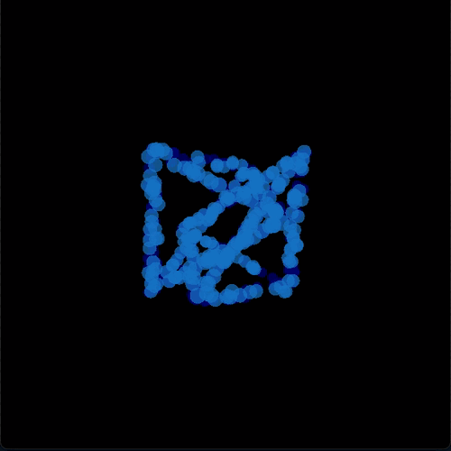

# AudioVisualSynth

<p align="center">
  
</p>


Welcome to AudioVisualSynth, an interactive audio-visual synthesizer that combines 3D graphics rendering, MIDI-based audio synthesis, and a dynamic particle system to create a captivating multimedia experience. This project uses Python with libraries such as Pygame, OpenGL, and NumPy to bring music and visuals together in real-time.

## Features

- **3D Cube Visualization**: Render a cube with edges that react to the music.
- **MIDI Note Playback**: Use keyboard inputs to generate MIDI sounds.
- **Color Mapping**: Visualize MIDI notes with corresponding colors through a particle system.
- **Dynamic Particle System**: Particles move and change in response to music, providing a visual representation of the audio.
- **Music Sheets Images Processing**: Convert music sheets images to MIDI notes (beta).

### 3D Notes Animation

[Watch the video here](https://github.com/Dor-sketch/AudioVisualSynth/assets/138825033/42a33834-a56d-4695-8607-f15fd25d123d)


### `HaTikva` Synth Autoplay mode

[Watch the video here](https://github.com/Dor-sketch/AudioVisualSynth/assets/138825033/5d5aa6d6-9688-42f7-89ef-ec6a32943f91)

## Installation

To run AudioVisualSynth, you need to have Python installed along with several dependencies. Here's how you can get started:

### Prerequisites

- Python 3.8 or later
- Pygame
- PyOpenGL
- NumPy

### Setting Up

1. Clone the repository:

   ```bash
   git clone https://github.com/Dor-sketch/AudioVisualSynth.git
    cd AudioVisualSynth
    ```

2. Install the required packages:

    ```bash
    pip install -r requirements.txt
    ```

3. Run the main script:

   ```bash
   python main.py
   ```

## Usage

Use your keyboard to interact with the synthesizer. Each key corresponds to a different MIDI note and triggers a unique visual effect. For extanding a note, hold the `space` key while pressing the desired note - like in piano.

For example, the following keys are mapped to MIDI notes:

- `a` - C4
- `s` - D4
- `d` - E4
- `f` - F4
- `g` - G4
...

The sharps and flats are mapped to the keys above - like the black keys in piano.

- `w` - C#4
- `e` - D#4
- `t` - F#4
- `y` - G#4
...

## Contributing

Contributions are welcome! Feel free to open an issue or submit a pull request if you have any suggestions or improvements. The following are some ways you can contribute to this project:

- Performance optimization: The current implementation may not be optimized for speed or memory usage. You could help improve the performance of the synthesizer by optimizing the code or using more efficient algorithms.

- Improve user experience: The current user interface is minimalistic and may not be user-friendly. You could help improve the user experience by adding more features, improving the visual design, or providing better feedback to the user.

- Implement the music sheets images processing feature: The current implementation of the music sheets images processing feature is in beta and may not work correctly in all cases. You could help improve this feature by adding more robust image processing algorithms or improving the accuracy of the note detection.

## License

This project is licensed under the MIT License - see the [LICENSE](LICENSE) file for details.
