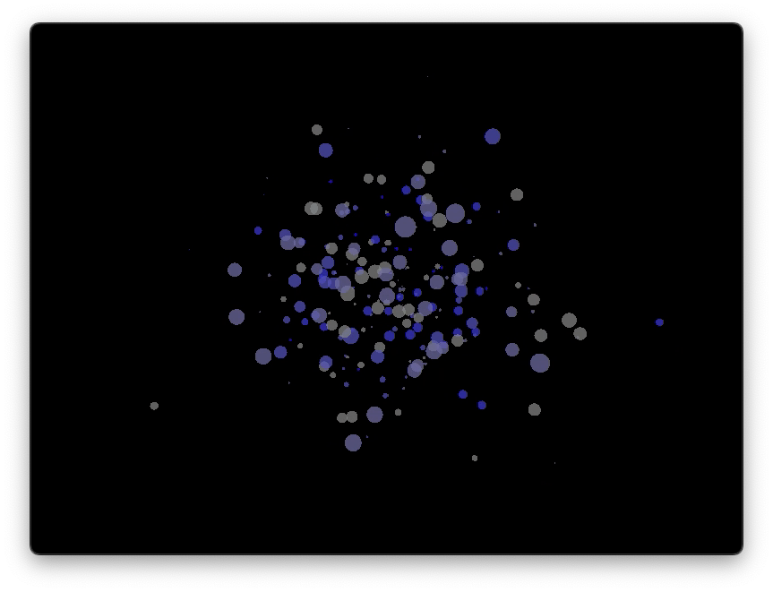

# AudioVisualSynth




Welcome to AudioVisualSynth, an interactive audio-visual synthesizer that combines 3D graphics rendering, MIDI-based audio synthesis, and a dynamic particle system to create a captivating multimedia experience. This project uses Python with libraries such as Pygame, OpenGL, and NumPy to bring music and visuals together in real-time.

## Features

- **3D Cube Visualization**: Render a cube with edges that react to the music.
- **MIDI Note Playback**: Use keyboard inputs to generate MIDI sounds.
- **Color Mapping**: Visualize MIDI notes with corresponding colors through a particle system.
- **Dynamic Particle System**: Particles move and change in response to music, providing a visual representation of the audio.
- **Music Sheets Images Processing**: Convert music sheets images to MIDI notes (beta).

## Installation

To run AudioVisualSynth, you need to have Python installed along with several dependencies. Here's how you can get started:

### Prerequisites

- Python 3.8 or later
- Pygame
- PyOpenGL
- NumPy

### Setting Up

1. Clone the repository:

   ```bash
   git clone https://github.com/Dor-sketch/AudioVisualSynth.git
    cd AudioVisualSynth
    ```

2. Install the required packages:

    ```bash
    pip install -r requirements.txt
    ```

3. Run the main script:

   ```bash
   python main.py
   ```

## Usage

Use your keyboard to interact with the synthesizer. Each key corresponds to a different MIDI note and triggers a unique visual effect.

## Contributing

Contributions are welcome! Feel free to open an issue or submit a pull request if you have any suggestions or improvements.

## License

This project is licensed under the MIT License - see the [LICENSE](LICENSE) file for details.
